# 100 front end projects
These are some of the basic projects that i practiced while learning basic front-end. They helped me a lot in my learning journey. They are basically a compilation of some projects
available on the internet from various resources like Youtube Github etc.
>Practice is the key, keep practicing :v:

## Table of Content
| &nbsp; &nbsp; &nbsp; &nbsp; &nbsp; &nbsp; Projects &nbsp; &nbsp; &nbsp; &nbsp; &nbsp; &nbsp; | &nbsp; &nbsp; &nbsp; &nbsp; &nbsp; &nbsp; Demo &nbsp; &nbsp; &nbsp; &nbsp; &nbsp; &nbsp; |  &nbsp; &nbsp; &nbsp; &nbsp; &nbsp; &nbsp; Description &nbsp; &nbsp; &nbsp; &nbsp; &nbsp; &nbsp;|
|  :----------------:   |   :------------------:  |     :--------------:       |
|[Project-1](#project-1)|   [live site ](https://sourabh358.github.io/100_projects.github.io/project-1/index2.html)    |Food Menu filter|
|   [Project-2](#project-2)   |   [live site](https://sourabh358.github.io/100_projects.github.io/project-2/grocery.html)    |Responsive grocery list|
|   [Project-3](#project-3)   |   [live site](https://sourabh358.github.io/100_projects.github.io/project-3/index.html)    |Responsive tabs|
|   [Project-4](#project-4)   |   [live site](https://sourabh358.github.io/100_projects.github.io/project-4/)              |Calculator App|
|   [Project-5](#project-5)   |   [live site](https://sourabh358.github.io/100_projects.github.io/project-5/)              |NFT Card|
|   [Project-6](#project-6)   |   [live site](https://sourabh358.github.io/100_projects.github.io/project-6/)              |Advice Generator App|
|   [Project-7](#project-7)   |   [live site](https://sourabh358.github.io/100_projects.github.io/project-7/)              |Animated website|
|   [Project-8](#project-8)   |   [live site](https://sourabh358.github.io/100_projects.github.io/project-8/)              |Animated Cards|
|   [Project-9](#project-9)   |   [live site](https://sourabh358.github.io/100_projects.github.io/project-9/)              |Remote Work landing page|
|   [Project-10](#project-10)   |   [live site](https://sourabh358.github.io/100_projects.github.io/project-10/)              |Expense tracker chart component|
|   [Project-11](#project-11)   |   [live site](https://sourabh358.github.io/100_projects.github.io/project-11/)              |Order Summary Component|
|   [Project-12](#project-12)   |   [live site](https://sourabh358.github.io/100_projects.github.io/project-12/)              |Room Home Page|
|   [Project-13](#project-13)   |   [live site](https://sourabh358.github.io/100_projects.github.io/project-13/)              |3-Column Card Component|
|   [Project-14](#project-14)   |   [live site](https://timely-torte-74a5d9.netlify.app/)                                     |profile card component|
|   [Project-15](#project-15)   |   [live site](https://magenta-narwhal-dab150.netlify.app/)                                     |Bookmark Landing Page|
|   [Project-16](#project-16)   |   [live site](https://musical-gelato-07fe55.netlify.app/)                                     |Time Tracking Dashboard|
|   [Project-17](#project-17)   |   [live site](https://thriving-mandazi-5946cd.netlify.app/)                                     |Product Preview Card|  

## Project-1
>Food Menu Filter

In this project We have a food menu filter that allows the user to filter food menu according to their preferences.

### Built With
- HTML
- CSS
- JAVASCRIPT
    
You can check the code for the [project](/project-1) in my repo. **Here you can check the live working [demo](https://sourabh358.github.io/100_projects.github.io/project-1/index2.html)**  

### Screenshot  

    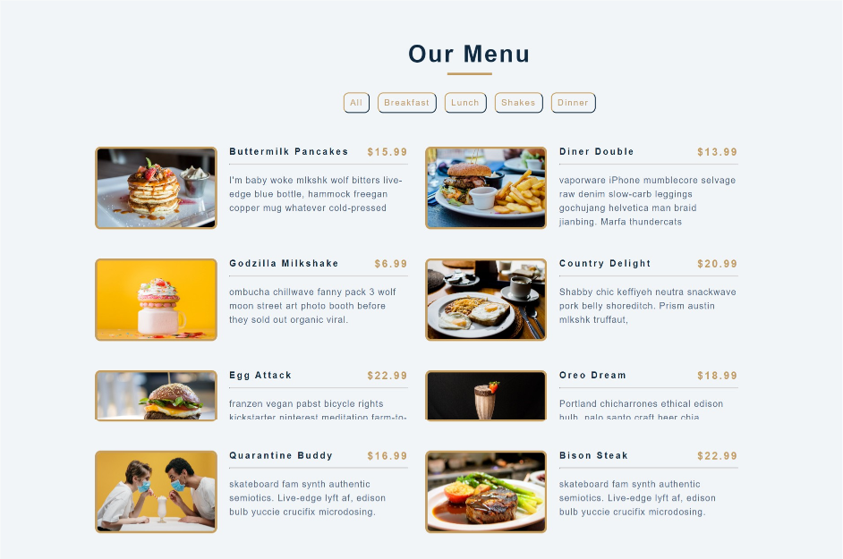

## Project-2  
>Grocery Bud   

In this project i have build a grocery bud app. It uses the local storage to create and retain the list.  

### Built With
- HTML
- CSS
- JAVASCRIPT
    
You can check my code for the [project](./project-2) in the repo. **Here check the [live](https://sourabh358.github.io/100_projects.github.io/project-2/grocery.html) demo**

### Screenshot  

    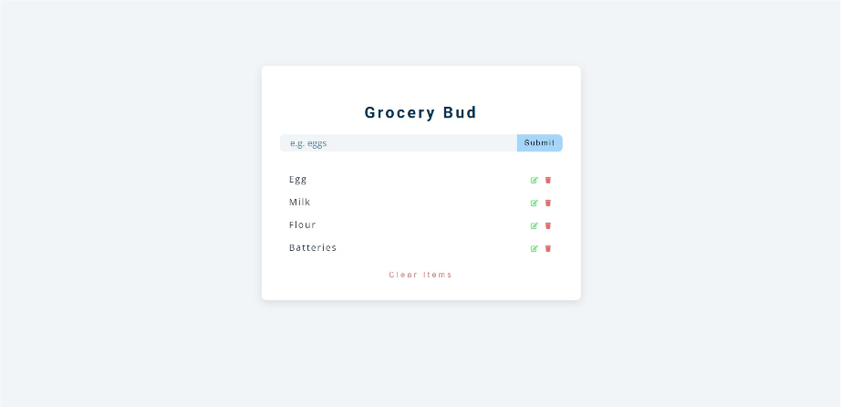

## Project-3  
>Responsive Tabs   

In this project I have made responsive tabs, which switch using javascript. It is a very basic project and will help beginners learning web development.

### Built With  
- HTML
- CSS
- JAVASCRIPT
    
### Screenshot

    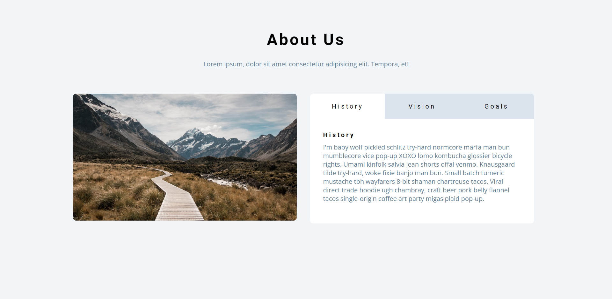

  

### Links  
[Code](./project-3)  
Live -  [Live website URL here](https://sourabh358.github.io/100_projects.github.io/project-3/index.html)  

## Project-4
>Calculator App

In this project I have made a basic calculator App. It is in completion of frontend mentor challenge. App has three different themes which can changed using a single toggle switch.  

### Built With
- HTML
- CSS
- SASS/SCSS
- JAVASCRIPT
- Mobile first Workflow
- CSS Grid
- CSS Flexbox  

### Screenshot

    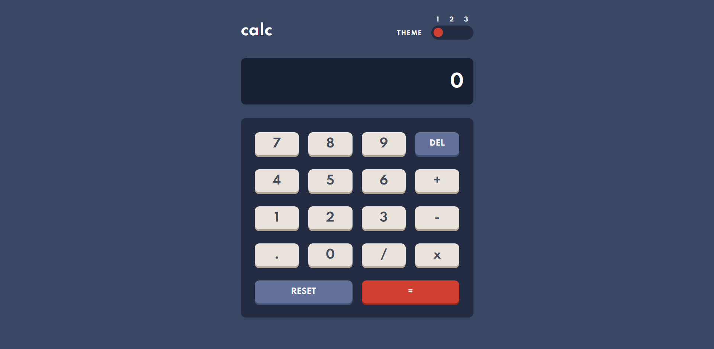

    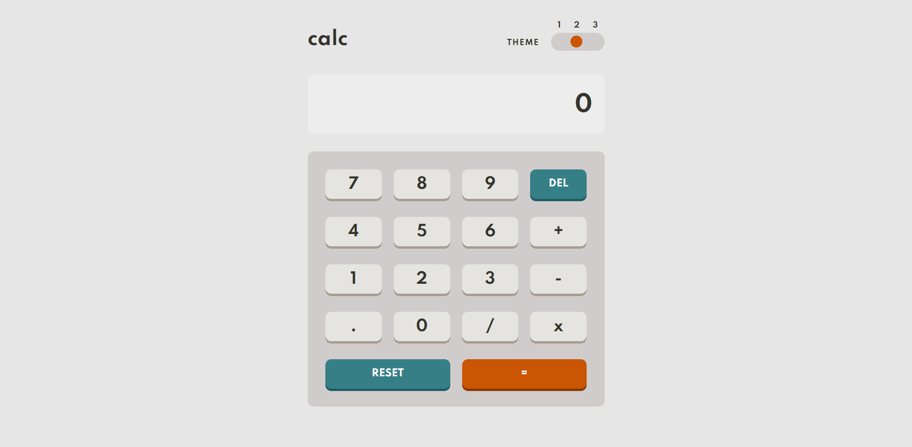

    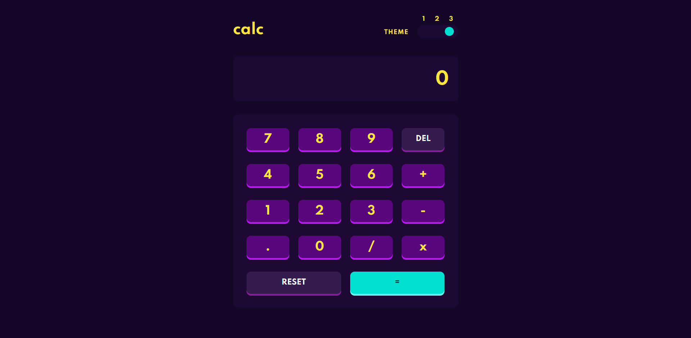

  

### Links  
[Code](./project-4)  
Solution Url - [Solution URL here](https://www.frontendmentor.io/solutions/calculator-app-M5y3LNQ0r)  
Live Website - [Live Website URL here](https://sourabh358.github.io/100_projects.github.io/project-4/)

## Project-5
>NFT Card

This project is a challenge completed by me at Frontendmentor. It is a NFT Card for Eutherium with some cool UI.  

### Built With
- HTML
- CSS

### Screenshot  

    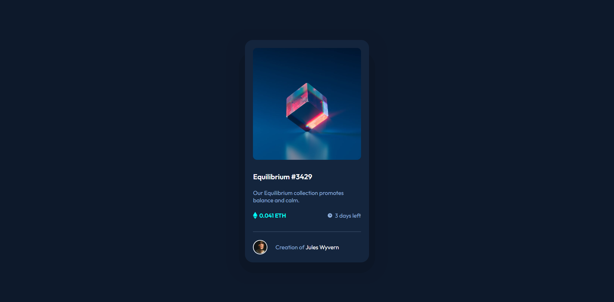

  

### Links
[Code](./project-5)  
Solution Url - [Solution URL here](https://www.frontendmentor.io/solutions/nft-preview-card-component-challenge-hub-KXd3-rg4G)  
Live Website - [Live Website URL here](https://sourabh358.github.io/100_projects.github.io/project-5/)

## Project-6
>Advice Generator App

This is another challenge completed by me of Frontendmentor. It is an amazing website to practice front end. the following project is Advice Generator App, displaying different advices using an API.  

### Built With
- HTML  
- CSS  
- SASS/SCSS  
- JAVASCRIPT
- API
    
### Screenshot  

    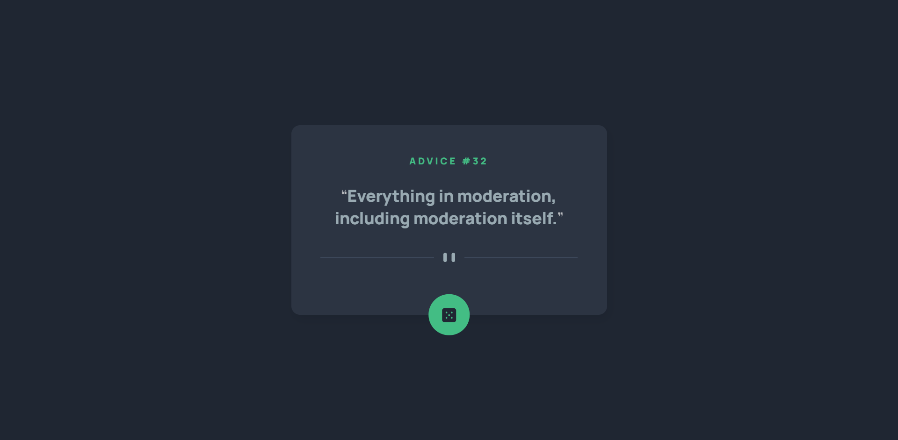

  

### Links
[Code](./project-6)  
Solution Url - [Solution URL here](https://www.frontendmentor.io/solutions/responsive-advice-generator-app-ulVxNw9TH)  
Live Website - [Live Website URL here](https://sourabh358.github.io/100_projects.github.io/project-6/)  

## Project-7
>Animated website

This is an animated website. Website is divided into two partitions which change sizes and translate on hover which make it look very beautiful. Hope you like it.

### Built With
- HTML  
- CSS
- Javascript  
    
### Screenshot  

    

  

### Links
[Code](./project-7)  
Live Website - [Live Website URL here](https://sourabh358.github.io/100_projects.github.io/project-7/)  

## Project-8
>Animated Cards

In this project I have made animated cards which expands and contracts after being clicked. Do check it out.  

### Built With
- HTML  
- CSS
- Javascript  
    
### Screenshot  

    

  

### Links
[Code](./project-8)  
Live Website - [Live Website URL here](https://sourabh358.github.io/100_projects.github.io/project-8/)  

## Project-9
>Remote work landing page

In this project I have completed one of the challenges of Front end mentor. Challenge was to design a landing page for Remote work website.  

### Built With
- HTML  
- CSS
- SCSS
- Javascript  
    
### Screenshot  

    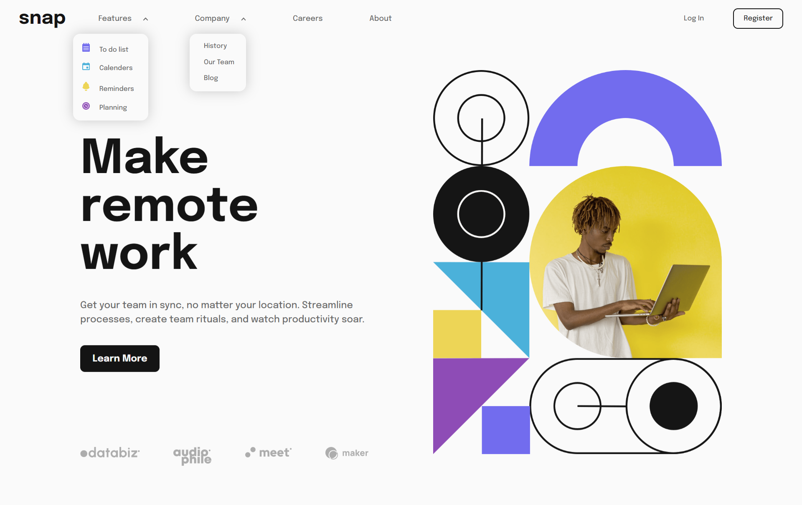

 

### Links
[Code](./project-9)  
Solution Url - [Solution URL here](https://www.frontendmentor.io/solutions/intro-section-with-dropdown-navigation-BkgzY7CUq)  
Live Website - [Live Website URL here](https://sourabh358.github.io/100_projects.github.io/project-9/)  

## Project-10
>Expense tracker chart component

In this project I have completed one of the challenges of Front end mentor. Challenge was to design a static chart component of an expense tracker app. Files and style guide were provided for the challenge below is my solution link.  

### Built With
- HTML  
- CSS
- SCSS  

### Screenshot  

    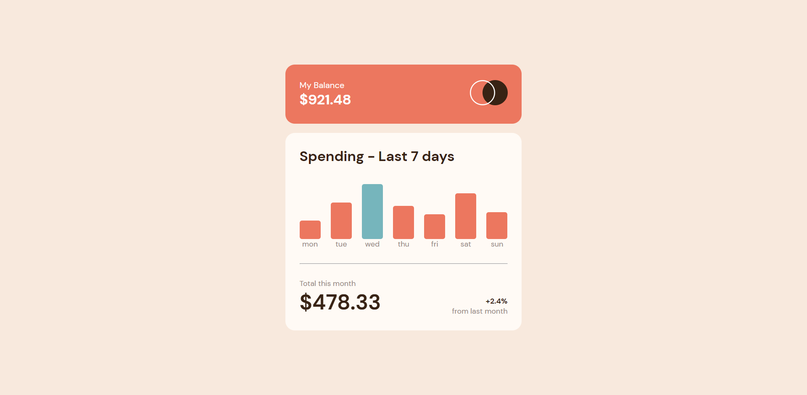

 
    
### Links
[Code](./project-10)  
Solution Url - [Solution URL here](https://www.frontendmentor.io/solutions/expense-tracker-chart-component-Zb4VAxQC9H)  
Live Website - [Live Website URL here](https://sourabh358.github.io/100_projects.github.io/project-10/)  

## Project-11
>Order Summary Component

In this project I have completed one of the challenges of Front end mentor. Challenge was to design a static order summary component. Files and style guide were provided for the challenge below is my solution link.  

### Built With
- HTML  
- CSS
- SCSS
    
### Screenshot  

    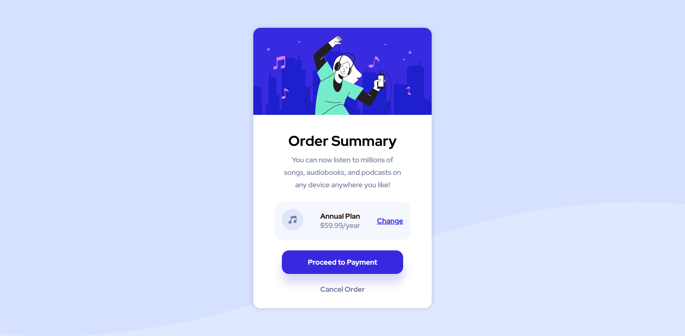

 

### Links
[Code](./project-11)  
Solution Url - [Solution URL here](https://www.frontendmentor.io/solutions/order-summary-component-DKFunM18_X)  
Live Website - [Live Website URL here](https://sourabh358.github.io/100_projects.github.io/project-11/)

## Project-12
>Room Home Page

In this project I have completed one of the challenges of Front end mentor. Challenge was to design a static remote home page. Files and style guide were provided for the challenge below is my solution link.  

### Built With
- HTML  
- CSS
- SCSS
- JS
    
### Screenshot  

    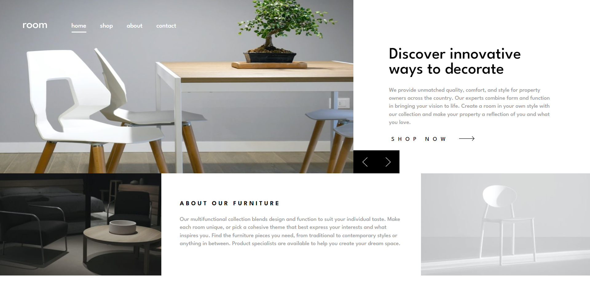

 

### Links
[Code](./project-12)  
Solution Url - [Solution URL here](https://www.frontendmentor.io/solutions/room-home-page-7q8VPz8BWy)  
Live Website - [Live Website URL here](https://sourabh358.github.io/100_projects.github.io/project-12/)

## Project-13
>3-Column Card Component

In this project I have completed one of the challenges of Front end mentor. Challenge was to design a static 3-Column Card Component. Files and style guide were provided for the challenge below is my solution link.  

### Built With
- HTML  
- CSS
- SCSS
    
### Screenshot

    

 

### Links
[Code](./project-13)  
Solution Url - [Solution URL here](https://www.frontendmentor.io/solutions/3column-card-component-WUgAXxaOgK)  
Live Website - [Live Website URL here](https://sourabh358.github.io/100_projects.github.io/project-13/)  

 

## Project-14
>Profile-Card-Component

In this project I have completed one of the challenges of Front end mentor. Challenge was to design a static Profile Card Component. Files and style guide were provided for the challenge below is my solution link.

### Built With
- Semantic HTML5 markup
- tailwind css
    
### Screenshot  

    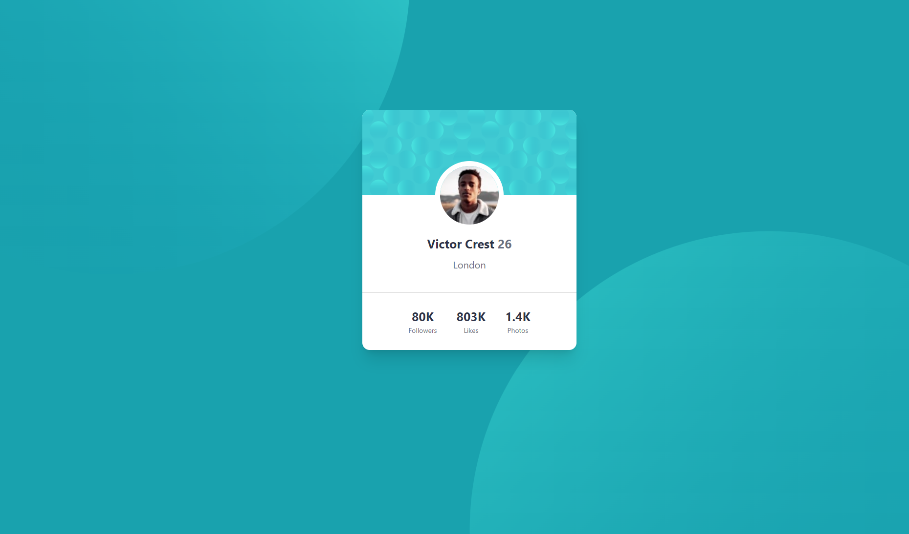

### Links
[Code](./project-14)  
Solution Url - [Solution URL here](https://www.frontendmentor.io/solutions/profile-card-component-15N9uwqTLm)  
Live Website - [Live Website URL here](https://timely-torte-74a5d9.netlify.app/)  

  

## Project-15
>Bookmark Landing Page

In this project I have completed one of the challenges of Front end mentor. Challenge was to design a static Bookmark Landing-Page. Files and style guide were provided for the challenge below is my solution link.

### Built With
- Semantic HTML5 markup
- tailwind css
- netlify
    
### Screenshot  

    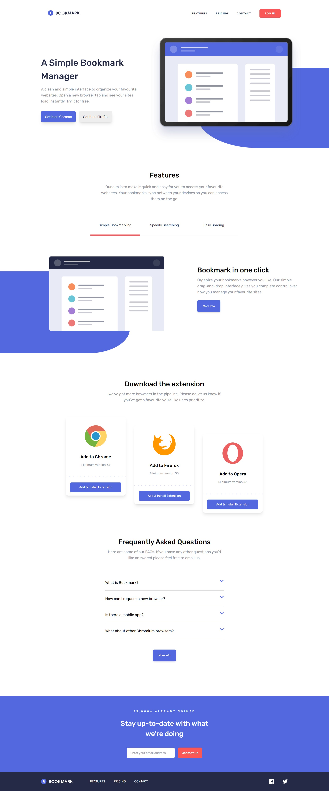

  

### Links
[Code](./project-15)  
Solution Url - [Solution URL here](https://www.frontendmentor.io/solutions/bookmark-landing-page-4Txu18kFoA)  
Live Website - [Live Website URL here](https://magenta-narwhal-dab150.netlify.app/)  

## Project-16
>Time Tracking dashboard

In this project I have completed one of the challenges of Front end mentor. Challenge was to design a static Time Tracking dashboard. Files and style guide were provided for the challenge below is my solution link.

### Built With
- Semantic HTML5 markup
- tailwind css
- netlify
  
### Screenshot  

    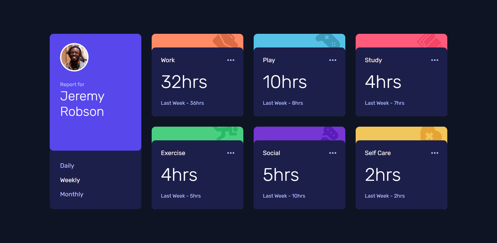

 

    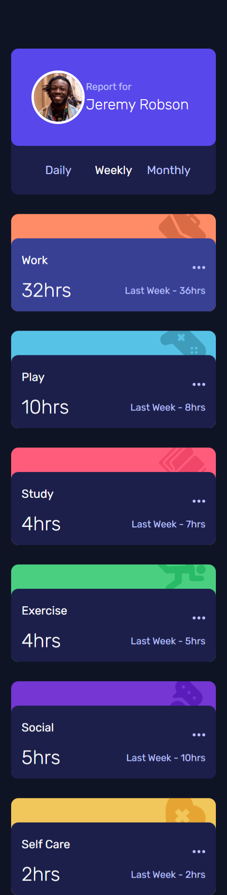

 

### Links
[Code](./project-16)  
Solution Url - [Solution URL here](https://www.frontendmentor.io/solutions/time-tracking-dashboard-SfPtQnA769)  
Live Website - [Live Website URL here](https://musical-gelato-07fe55.netlify.app/)  

## Project-17
>Project preview card component

In this project I have completed one of the challenges of Front end mentor. Challenge was to design a static Product Preview Card Component. Files and style guide were provided for the challenge below is my solution link.

### Built With
- Semantic HTML5 markup
- tailwind css
- netlify
    
### Screenshot  

    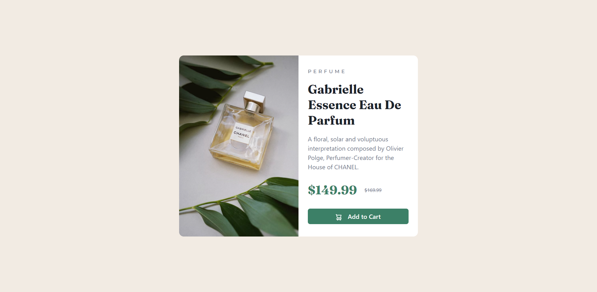

  

### Links
[Code](./project-17)  
Solution Url - [Solution URL here](https://www.frontendmentor.io/solutions/product-preview-card-component-ePWujdIscU)  
Live Website - [Live Website URL here](https://thriving-mandazi-5946cd.netlify.app/)  

## Project-19
>Email Validator

A simple email validation application that verifies given url.  
Check live [Demo]()

### Built With
- Semantic HTML5 markup
- CSS
- Javascript
    
[Code](./project-19)  
Live Website - [Live Website URL here](https://sourabh358.github.io/100_projects.github.io/project-19/index.html)  

## Author
Frontend Mentor - [@sourabh358](https://www.frontendmentor.io/profile/sourabh358)  
GitHub - [@Sourabh358](https://github.com/SOURABH358)  
❤ Sourabh Yadav
